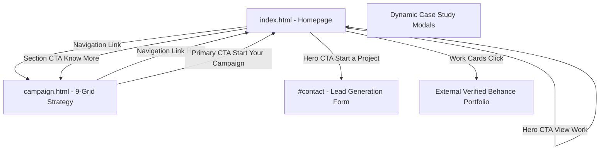

# Internal Linking & Information Architecture Guide

An optimized internal linking structure distributes PageRank authority efficiently, guides Googlebot to high-value pages, and maximizes user conversion pathways.

---

## 1. Primary Site Architecture Flow

---

## 2. Anchor Text Optimization Matrix

Avoid generic anchor texts like "click here" or "more". Implement keyword-rich, natural anchor phrasing:

| Link Origin | Target URL | Existing / Weak Text | Optimized Descriptive Anchor Text |
| :--- | :--- | :--- | :--- |
| `index.html#recent` | `campaign.html#campaign-details` | `Know More` | `Explore 9-Grid Instagram Strategy` |
| `index.html` Navbar | `campaign.html` | `Campaign` | `9-Grid Campaign` |
| `campaign.html` Hero CTA | `index.html#contact` | `Start Your Campaign` | `Book an Instagram 9-Grid Campaign` |
| `campaign.html` Nav | `index.html#work` | `Work` | `View Full Branding Portfolio` |
| Search Overlay | `campaign.html` | `Campaign` | `Instagram 9-Grid Strategy & Case Studies` |

---

## 3. Deep-Linking In Search Overlay

The existing JavaScript search feature (`script.js` line 107 `searchData`) serves as an internal navigation directory. We ensure it points users and internal crawlers to keyword-rich semantic destinations:

* `"9-Grid Instagram Strategy"` → `campaign.html`
* `"Brand Identity & Logo Design"` → `index.html#services`
* `"Kibblix Pet Nutrition Case Study"` → `index.html#kibblix`
* `"FRAGRO Perfume Lab Campaign"` → `index.html#recent`
* `"Print & Brochure Design"` → `index.html#services`
* `"Contact & Booking"` → `index.html#contact`
